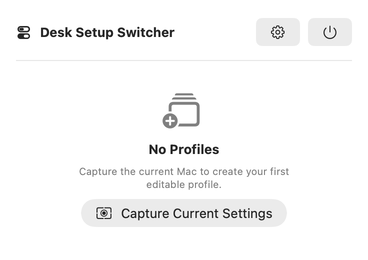
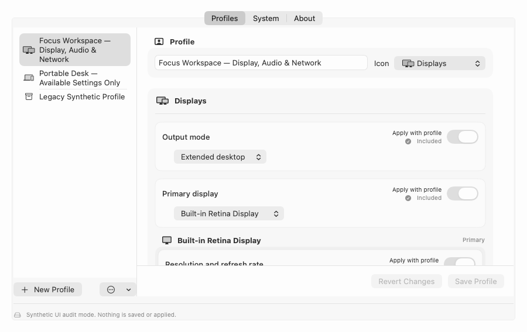
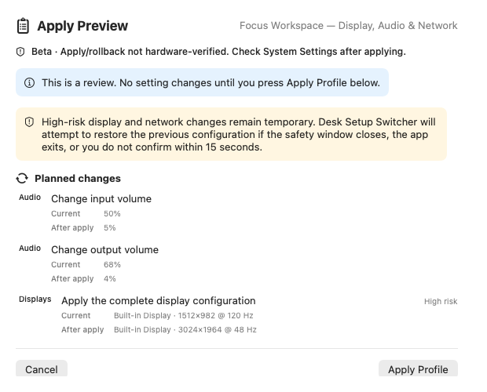

# Desk Setup Switcher

A simple, local-only macOS menu-bar app for moving between desk setups without changing settings behind your back.

Save selected display, audio, and network settings as a profile. When you want to use it, review the exact plan and decide what to apply.

> [!IMPORTANT]
> **Unreleased public beta:** there is no supported public download yet. Current local and CI artifacts are development-only; they are not Developer ID signed or notarized. The first supported build will be a signed, notarized DMG on [GitHub Releases](https://github.com/GGULBAE/desk-setup-switcher/releases) after the [public-beta completion gates](docs/COMPLETION-CRITERIA.md) pass. Do not redistribute a development DMG or create or push a `v*` tag.

[English user guide](docs/guides/USER-GUIDE.md) · [한국어 사용자 가이드](docs/guides/USER-GUIDE.ko.md) · [Support matrix](docs/SUPPORT-MATRIX.md)

## How it works

### 1. Capture

Choose **Capture Current Settings** from the menu-bar app. Capture reads the current Mac state and creates a profile for review; it does not change a setting.



### 2. Edit

Name the profile and keep only the display, audio, and network values that should change. Unsupported or unavailable values are not presented as safe, runnable choices.



### 3. Review, then apply

Inspect every proposed change and omission. Nothing changes until you explicitly choose **Apply Profile** or **Apply Available Settings**.



The screenshots contain synthetic data from a non-mutating demo state. They show the intended product flow, not live hardware-mutation evidence. See the [asset provenance record](docs/RELEASE-ASSET-PROVENANCE.md) and [static demo-site source](site/README.md).

When a saved profile matches the current Mac, the menu-bar indicator shows its profile name on one horizontal line.

## Install

Supported binaries will be provided only through versioned GitHub Releases. When this README identifies a release as supported:

1. Get its signed, notarized DMG and checksum from the project’s [GitHub Releases page](https://github.com/GGULBAE/desk-setup-switcher/releases).
2. Verify the checksum, drag **Desk Setup Switcher** to **Applications**, and launch it. The app appears in the menu bar rather than the Dock.
3. Start with a small profile and inspect both the preview and the itemized result.

If macOS cannot verify an official release, stop and report it. Do not bypass Gatekeeper for an end-user installation.

## Privacy and safety

- Profiles, backups, and diagnostics stay on the Mac. There is no account, cloud sync, app-owned server, telemetry, analytics, ads, or automatic profile switching.
- Capture is read-only. Applying a profile always requires an explicit review and confirmation.
- The app reads current state again before execution. If the profile, device state, capability, or rollback evidence changed, it applies nothing and returns to an updated review.
- High-risk display and network changes use a 15-second **Keep Changes / Revert Now** window. A timeout, close, confirmation failure, or fatal transaction error requests rollback where supported.
- Rollback is an attempt, not a guarantee. Results distinguish applied, skipped, failed, rolled back, rollback-failed, and unverified outcomes so you can check the current macOS state directly.

Exports can contain device labels, SSIDs, network ranges, stable identifiers, and dormant legacy conditions. Review them before sharing. Profiles never contain Wi-Fi passwords. Read the [privacy policy](docs/PRIVACY.md) for the complete data boundary.

## Permissions and current limits

| Access | When it may be needed | If declined |
| --- | --- | --- |
| Location | macOS may require it to reveal the current Wi-Fi name during Capture | Capture continues without Wi-Fi; unrelated display, audio, and wired-network values remain available |
| macOS authorization | An included, service-specific IPv4 change may require protected SystemConfiguration access | The change is cancelled or reported as not applied |
| Launch at login | Only after you enable it in Settings | The app remains manual-launch only; this preference is off by default |

Selecting an audio input device does not record audio and does not require microphone access.

The planned initial public beta targets Apple Silicon and macOS 14 Sonoma, but exact-candidate Sonoma lifecycle evidence is still required before that becomes a support claim. The project builds an `x86_64` slice, but physical Intel installation and runtime testing have not passed, so Intel is not supported. Current user-facing profile work is limited to Display, Audio, and Network; no live setting mutation or hardware rollback is claimed as verified. See the [support matrix](docs/SUPPORT-MATRIX.md) for capability-level evidence.

## Build from source

Contributors need full Xcode and a Swift 6.1-or-later toolchain.

```sh
git clone https://github.com/GGULBAE/desk-setup-switcher.git
cd desk-setup-switcher
make verify
```

`make verify` is the canonical local gate. Its packaged DMG is ad-hoc signed development evidence, not a supported release. See [CONTRIBUTING.md](CONTRIBUTING.md) for the development workflow. Release engineering and remaining evidence are tracked in the [distribution guide](docs/DISTRIBUTION.md) and [completion ledger](docs/COMPLETION-CRITERIA.md).

## Documentation

- **Use the app:** [English guide](docs/guides/USER-GUIDE.md) · [한국어 가이드](docs/guides/USER-GUIDE.ko.md) · [Support](SUPPORT.md)
- **Understand the boundaries:** [Privacy](docs/PRIVACY.md) · [Support matrix](docs/SUPPORT-MATRIX.md) · [Product scope](docs/PRODUCT.md)
- **Build or integrate:** [Profile JSON schema](docs/PROFILE-SCHEMA.md) · [Architecture](docs/ARCHITECTURE.md) · [Adapter contract](docs/ADAPTER-CONTRACT.md)
- **Prepare a release:** [Distribution gates](docs/DISTRIBUTION.md) · [External-beta v3 contract](docs/EXTERNAL-BETA-REPORT-TEMPLATE.md) · [Completion ledger](docs/COMPLETION-CRITERIA.md)

## Contributing, support, and security

Contributions are welcome. Start with [CONTRIBUTING.md](CONTRIBUTING.md) and follow the [Code of Conduct](CODE_OF_CONDUCT.md). Keep changes inside the project’s local-only, explicit-apply safety model.

Use [SUPPORT.md](SUPPORT.md) for questions and ordinary bug reports. For vulnerabilities, unsafe mutations, privacy leaks, exposed secrets, or rollback failures, follow [SECURITY.md](SECURITY.md). Private vulnerability reporting is currently disabled: request a private channel without putting sensitive details in the initial contact, and never report a vulnerability in a public issue.

Desk Setup Switcher is available under the [MIT License](LICENSE).
