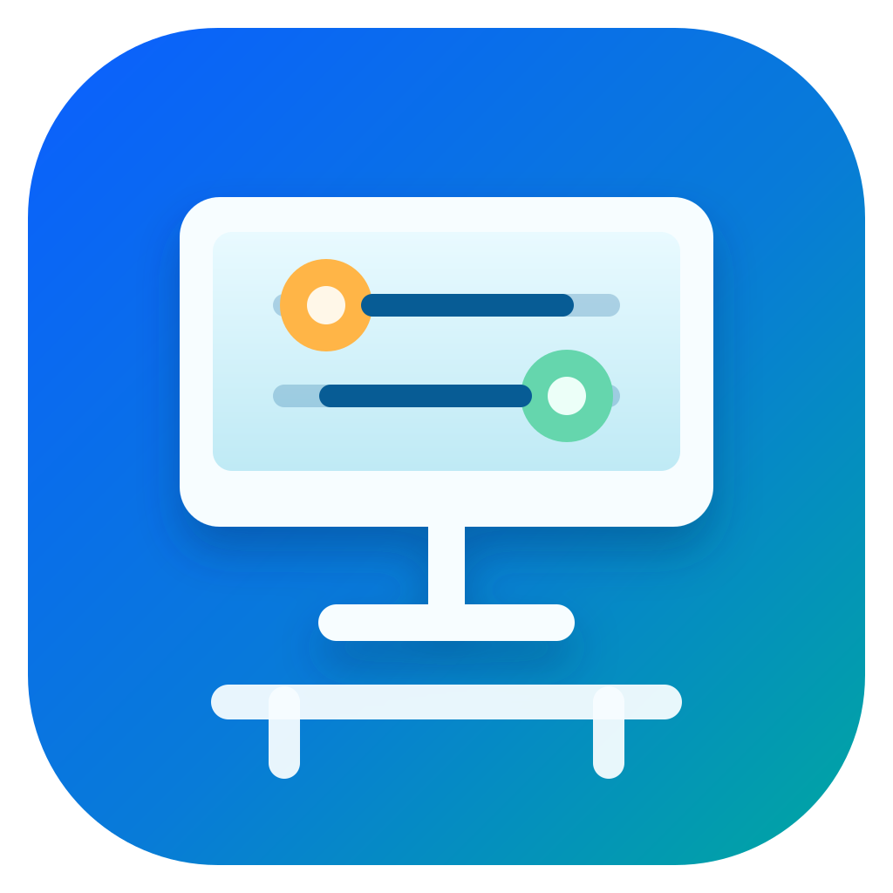
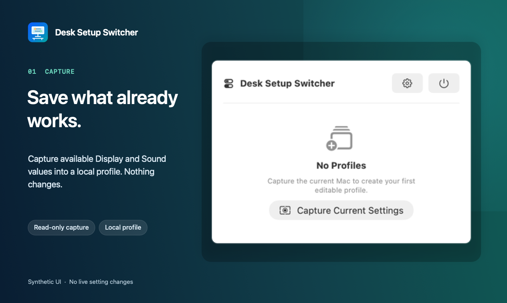
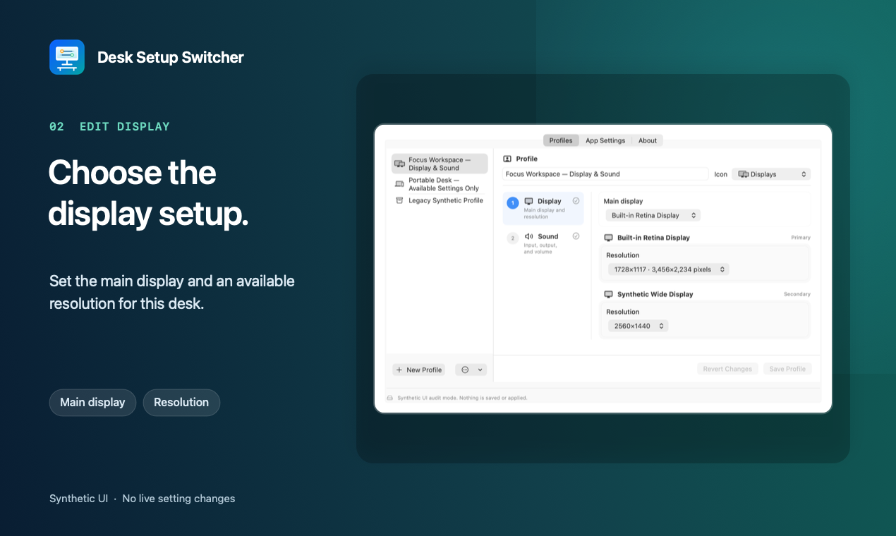
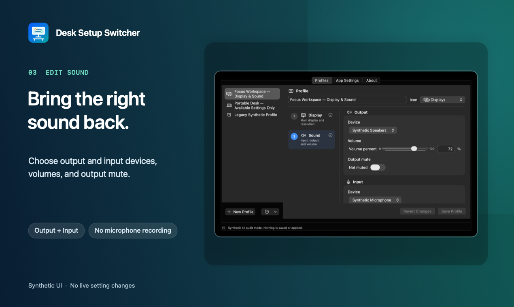
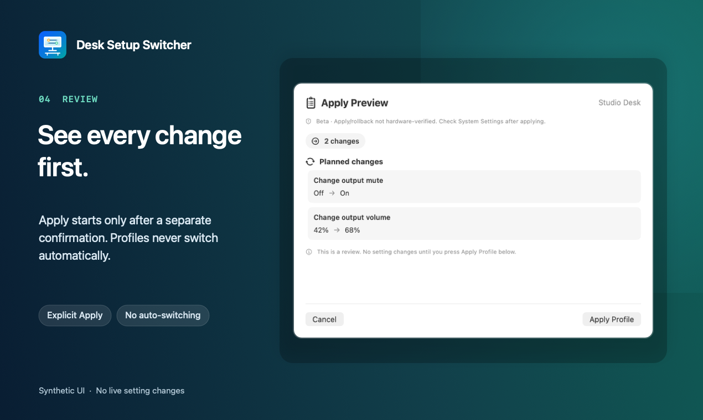

<p align="center">
  
</p>

<h1 align="center">Desk Setup Switcher</h1>

<p align="center"><strong>Bring your desk back, deliberately.</strong></p>

<p align="center">
  Move between desks without rebuilding your Mac setup.<br>
  Save display and sound settings as local profiles, preview every proposed change, and apply only when you are ready.
</p>

<p align="center">
  <a href="https://github.com/GGULBAE/desk-setup-switcher/actions/workflows/ci.yml"></a>
  <a href="LICENSE"></a>
  
</p>

<p align="center">
  <a href="docs/guides/USER-GUIDE.md">English guide</a> ·
  <a href="docs/guides/USER-GUIDE.ko.md">한국어 가이드</a> ·
  <a href="docs/SUPPORT-MATRIX.md">Support matrix</a>
</p>

Desk Setup Switcher is a macOS menu-bar app for people who use the same Mac at different desks. Capture the setup that works at home, the office, or a studio, then return to it without hunting through System Settings each time.

> [!IMPORTANT]
> **Public beta is being prepared. There is no supported public download yet.** The first supported build is planned as a free, Developer ID-unsigned DMG on [GitHub Releases](https://github.com/GGULBAE/desk-setup-switcher/releases) after the [public-beta completion gates](docs/COMPLETION-CRITERIA.md) pass. Local builds and ordinary CI artifacts are unsupported.

## See the whole flow

<table>
  <tr>
    <td width="50%"></td>
    <td width="50%"></td>
  </tr>
  <tr>
    <td width="50%"></td>
    <td width="50%"></td>
  </tr>
</table>

<p align="center">
  <a href="site/public/demo/desk-setup-switcher.mp4">Watch the 40-second silent product tour</a> ·
  <a href="site/public/demo/captions.en.vtt">English captions</a> ·
  <a href="site/public/demo/captions.ko.vtt">한국어 자막</a>
</p>

<p align="center"><sub>Exact-commit synthetic product data. No personal device identifiers, live Capture, Apply, or hardware changes.</sub></p>

## One Mac, more than one desk

Changing desks often means repeating the same small decisions: choose the main display, restore a resolution, select the right speakers or microphone, and reset their levels.

Desk Setup Switcher keeps those choices together in a named profile, so every change begins with a clear plan instead of guesswork.

## Why Desk Setup Switcher?

| Product value | What you get |
| --- | --- |
| **Less setup repetition** | Keep the display and sound choices for each desk together in one named profile. |
| **Control before convenience** | See the exact plan, unavailable items, and risks before anything changes. Profiles never switch automatically. |
| **A safer display workflow** | Protected display changes use a 15-second **Keep Changes / Revert Now** window. |
| **Privacy by architecture** | No account, cloud sync, app-owned server, telemetry, analytics, advertising, or automatic/background profile switching. |

## Capture. Review. Get back to work.

1. **Capture** reads the current Display and Sound values into a local profile. It changes nothing.
2. **Edit** gives the setup a useful name and lets you choose from the values available on that Mac.
3. **Review & Apply** shows proposed changes and omissions. Only a separate confirmation starts the change.

## One profile, seven setting types

| Display | Sound output | Sound input |
| --- | --- | --- |
| Main display | Output device | Input device |
| Resolution | Output volume | Input volume |
|  | Output mute |  |

That is the complete current product scope. Network settings, editable refresh rate, mirroring, ColorSync profiles, per-setting inclusion switches, and automatic switching are not current features.

## Designed to earn trust

- Capture is read-only, and Apply always starts with a visible plan and explicit confirmation.
- The app reads current state again immediately before execution. If the plan changed, it applies nothing and returns to review.
- Protected display changes remain temporary until you keep them. Rollback is attempted when required, but is not presented as a guarantee.
- Results distinguish applied, skipped, failed, rolled-back, rollback-failed, and unverified outcomes.
- Selecting an audio input device does not record audio or require microphone access.

Profiles, backups, and diagnostics stay on the Mac. Exports can contain device labels and stable identifiers, so review them before sharing. See the [privacy policy](docs/PRIVACY.md) for the complete boundary.

## Current beta status

- The initial public-beta target is Apple Silicon on macOS 14 Sonoma. Exact release-candidate lifecycle evidence is still required before that becomes a supported public claim.
- Current-source Capture and device discovery have read-only hardware evidence. Apply and rollback have deterministic mock evidence only; no live hardware mutation is claimed as verified.
- Public release remains on hold until the documented lifecycle, external-beta, and publication gates pass.

For the evidence behind each statement, see the [support matrix](docs/SUPPORT-MATRIX.md) and [completion ledger](docs/COMPLETION-CRITERIA.md).

## Follow the public beta

- Follow the [repository](https://github.com/GGULBAE/desk-setup-switcher) and check [GitHub Releases](https://github.com/GGULBAE/desk-setup-switcher/releases) for launch updates.
- Read the [distribution guide](docs/DISTRIBUTION.md) before installing an unsigned beta.
- Use [GitHub Issues](https://github.com/GGULBAE/desk-setup-switcher/issues) for non-sensitive feedback and [SECURITY.md](SECURITY.md) for security reports.

## Build from source

Contributors need full Xcode and a Swift 6.1-or-later toolchain.

```sh
git clone https://github.com/GGULBAE/desk-setup-switcher.git
cd desk-setup-switcher
make verify
```

`make verify` is the canonical non-live gate. It does not mutate display, audio, network, mouse, or keyboard settings. See [CONTRIBUTING.md](CONTRIBUTING.md) for the development workflow.

## Documentation

- **Use the app:** [English guide](docs/guides/USER-GUIDE.md) · [한국어 가이드](docs/guides/USER-GUIDE.ko.md) · [Support](SUPPORT.md)
- **Understand the boundaries:** [Privacy](docs/PRIVACY.md) · [Support matrix](docs/SUPPORT-MATRIX.md) · [Product scope](docs/PRODUCT.md)
- **Build or integrate:** [Profile JSON schema](docs/PROFILE-SCHEMA.md) · [Architecture](docs/ARCHITECTURE.md) · [Adapter contract](docs/ADAPTER-CONTRACT.md)
- **Track the release:** [Distribution gates](docs/DISTRIBUTION.md) · [External-beta report contract](docs/EXTERNAL-BETA-REPORT-TEMPLATE.md) · [Completion ledger](docs/COMPLETION-CRITERIA.md)

## Open source

Desk Setup Switcher is available under the [MIT License](LICENSE). Contributions are welcome—start with [CONTRIBUTING.md](CONTRIBUTING.md) and the [Code of Conduct](CODE_OF_CONDUCT.md).
