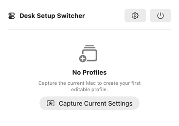
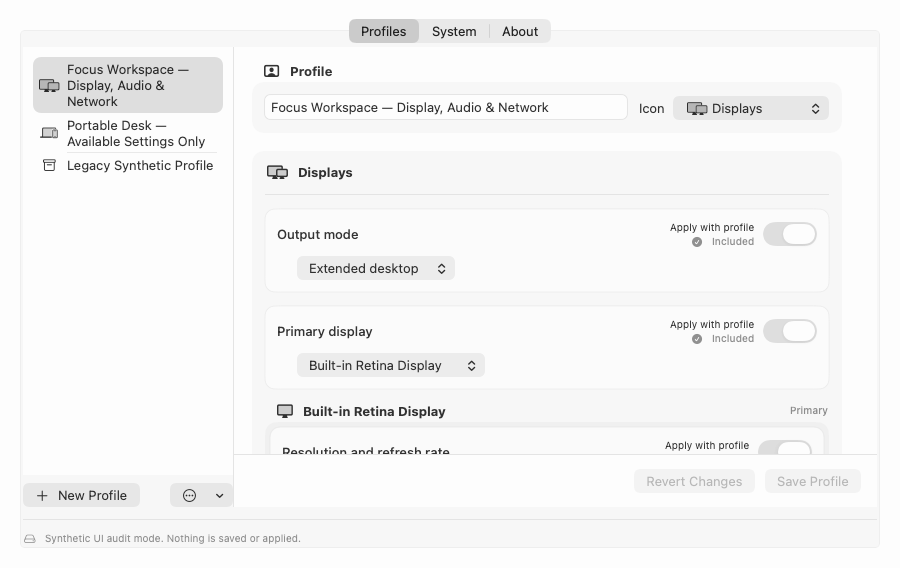
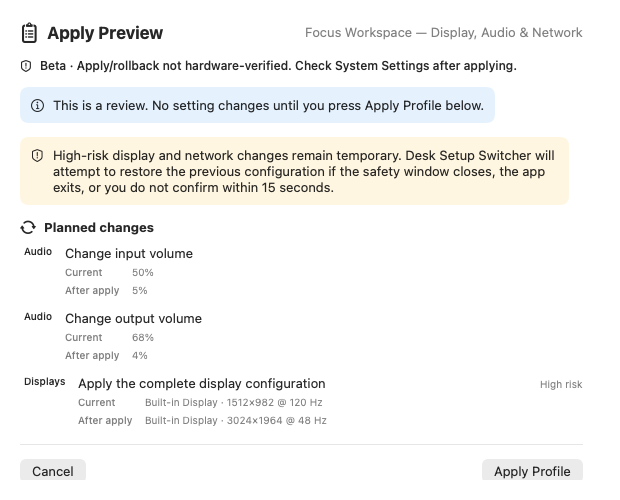

# Desk Setup Switcher

A simple, local-only macOS menu-bar app for moving between desk setups without changing settings behind your back.

Save selected display, audio, and network settings as a profile. When you want to use it, review the exact plan and decide what to apply.

> [!IMPORTANT]
> **Unreleased public beta:** there is no supported public download yet. The first supported build will be a free, Developer ID-unsigned DMG on [GitHub Releases](https://github.com/GGULBAE/desk-setup-switcher/releases) after the [public-beta completion gates](docs/COMPLETION-CRITERIA.md) pass. Its app carries an ad-hoc integrity signature but is not notarized, so macOS will require a one-time **Open Anyway** decision. Local and ordinary CI artifacts remain unsupported; do not redistribute them or create or push a `v*` tag.

[English user guide](docs/guides/USER-GUIDE.md) · [한국어 사용자 가이드](docs/guides/USER-GUIDE.ko.md) · [Support matrix](docs/SUPPORT-MATRIX.md)

## How it works

### 1. Capture

Choose **Capture Current Settings** from the menu-bar app. Capture reads the current Mac state and creates a profile for review; it does not change a setting.



### 2. Edit

Name the profile and keep only the display, audio, and network values that should change. Unsupported or unavailable values are not presented as safe, runnable choices.
For supported output devices, Audio captures volume and the separate output-mute state (`소리 끔`) so either value can be included or excluded independently.



### 3. Review, then apply

Inspect every proposed change and omission. Nothing changes until you explicitly choose **Apply Profile** or **Apply Available Settings**.



The screenshots contain synthetic data from a non-mutating demo state. They show the intended product flow, not live hardware-mutation evidence. See the [asset provenance record](docs/RELEASE-ASSET-PROVENANCE.md) and [static demo-site source](site/README.md).

When a saved profile matches the current Mac, the menu-bar indicator shows its profile name on one horizontal line.
The App Information page keeps its four project links centered as one compact group, with aligned icon and text columns.

The current productization polish turns profile editing into one focused step at a time: **Display**, **Sound**, and **Network** stay in a stable numbered rail at normal window sizes and collapse into a segmented selector only when space or text size requires it. Each step leads with the few choices most people need; resolution, refresh rate, ColorSync, audio input/mute, and manual IP fields stay behind **Advanced settings**. Validation still reveals and focuses a hidden invalid field, and choosing a network connection no longer disables another saved connection. Apply Preview, tray recovery, and minimum-window accessibility behavior retain their existing safety contracts. These are deterministic synthetic/offscreen improvements only; installed accessibility, hardware mutation/rollback, and release-distribution evidence remain required.

## Install

Supported binaries will be provided only through versioned GitHub Releases. There is no App Store release and the initial public beta does not require a paid Apple Developer Program membership. When this README identifies a release as supported:

1. Get the versioned `-unsigned.dmg` and checksum from the project’s [GitHub Releases page](https://github.com/GGULBAE/desk-setup-switcher/releases). Do not substitute an Actions artifact or third-party mirror.
2. Verify the SHA-256 checksum, open the DMG, and drag **Desk Setup Switcher** to **Applications**.
3. Try to open the app once. When macOS blocks the unidentified developer, open **System Settings → Privacy & Security**, choose **Open Anyway**, and confirm only after checking the release URL and checksum. The app appears in the menu bar rather than the Dock.
4. Start with a small profile and inspect both the preview and the itemized result.

Do not disable Gatekeeper globally, remove quarantine with `xattr`, or use an artifact whose checksum differs. The manual exception is expected only because this project currently uses the free unsigned distribution path.

## Privacy and safety

- Profiles, backups, and diagnostics stay on the Mac. There is no account, cloud sync, app-owned server, telemetry, analytics, ads, or automatic profile switching.
- Capture is read-only. Applying a profile always requires an explicit review and confirmation.
- The app reads current state again before execution. If the profile, device state, capability, or rollback evidence changed, it applies nothing and returns to an updated review.
- High-risk display and network changes use a 15-second **Keep Changes / Revert Now** window. A timeout, close, confirmation failure, or fatal transaction error requests rollback where supported.
- Rollback is an attempt, not a guarantee. Results distinguish applied, skipped, failed, rolled back, rollback-failed, and unverified outcomes so you can check the current macOS state directly.

Exports can contain device labels, SSIDs, network ranges, stable identifiers, and dormant legacy conditions. Review them before sharing. Profiles never contain Wi-Fi passwords. Read the [privacy policy](docs/PRIVACY.md) for the complete data boundary.

## Permissions and current limits

| Access | When it may be needed | If declined |
| --- | --- | --- |
| Location | macOS may require it to reveal the current Wi-Fi name during Capture | Capture continues without Wi-Fi; unrelated display, audio, and wired-network values remain available |
| macOS authorization | An included, service-specific IPv4 change may require protected SystemConfiguration access | The change is cancelled or reported as not applied |
| Launch at login | Only after you enable it in Settings | The app remains manual-launch only; this preference is off by default |

Selecting an audio input device does not record audio and does not require microphone access.

The planned initial public beta targets Apple Silicon and macOS 14 Sonoma, but exact-candidate Sonoma lifecycle evidence is still required before that becomes a support claim. The project builds an `x86_64` slice, but physical Intel installation and runtime testing have not passed, so Intel is not supported. The public DMG will be Developer ID-unsigned and not notarized; that packaging status is a deliberate cost-free distribution choice, not an Apple trust claim. Current user-facing profile work is limited to Display, Audio, and Network; no live setting mutation or hardware rollback is claimed as verified. See the [support matrix](docs/SUPPORT-MATRIX.md) for capability-level evidence.

## Build from source

Contributors need full Xcode and a Swift 6.1-or-later toolchain.

```sh
git clone https://github.com/GGULBAE/desk-setup-switcher.git
cd desk-setup-switcher
make verify
```

`make verify` is the canonical local gate. Release JSON evidence rejects decoded-equivalent duplicate keys with parser-independent scanning so local and CI Ruby versions enforce the same rule. Pull-request CI runs the app gate against GitHub's merge preview, then audits public Git history from a separate full-history checkout of the exact PR head so GitHub's temporary merge-commit identity is not mistaken for publishable repository history. Its packaged DMG uses the same no-Developer-ID packaging class planned for the public beta, but a local build is not supported unless its exact bytes and checksum are attached to the approved versioned GitHub Release. See [CONTRIBUTING.md](CONTRIBUTING.md) for the development workflow. Release engineering and remaining evidence are tracked in the [distribution guide](docs/DISTRIBUTION.md) and [completion ledger](docs/COMPLETION-CRITERIA.md).

## Documentation

- **Use the app:** [English guide](docs/guides/USER-GUIDE.md) · [한국어 가이드](docs/guides/USER-GUIDE.ko.md) · [Support](SUPPORT.md)
- **Understand the boundaries:** [Privacy](docs/PRIVACY.md) · [Support matrix](docs/SUPPORT-MATRIX.md) · [Product scope](docs/PRODUCT.md)
- **Build or integrate:** [Profile JSON schema](docs/PROFILE-SCHEMA.md) · [Architecture](docs/ARCHITECTURE.md) · [Adapter contract](docs/ADAPTER-CONTRACT.md)
- **Prepare a release:** [Distribution gates](docs/DISTRIBUTION.md) · [External-beta v3 contract](docs/EXTERNAL-BETA-REPORT-TEMPLATE.md) · [Completion ledger](docs/COMPLETION-CRITERIA.md)

## Contributing, support, and security

Contributions are welcome. Start with [CONTRIBUTING.md](CONTRIBUTING.md) and follow the [Code of Conduct](CODE_OF_CONDUCT.md). Keep changes inside the project’s local-only, explicit-apply safety model.

Use [SUPPORT.md](SUPPORT.md) for questions and ordinary bug reports. For vulnerabilities, unsafe mutations, privacy leaks, exposed secrets, or rollback failures, follow [SECURITY.md](SECURITY.md). Private vulnerability reporting is currently disabled: request a private channel without putting sensitive details in the initial contact, and never report a vulnerability in a public issue.

Desk Setup Switcher is available under the [MIT License](LICENSE).
