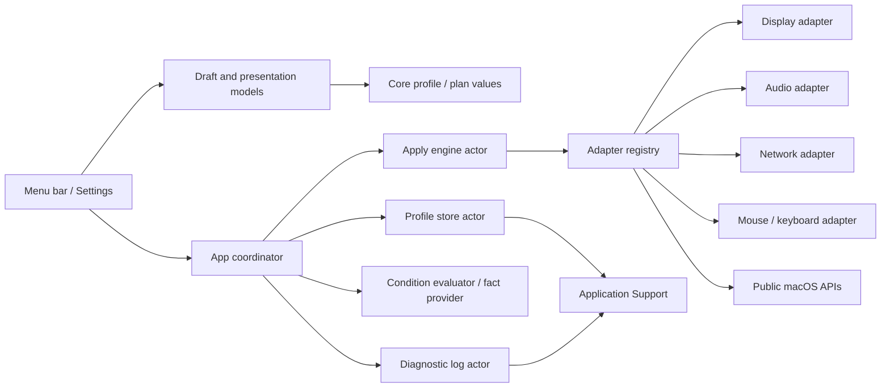
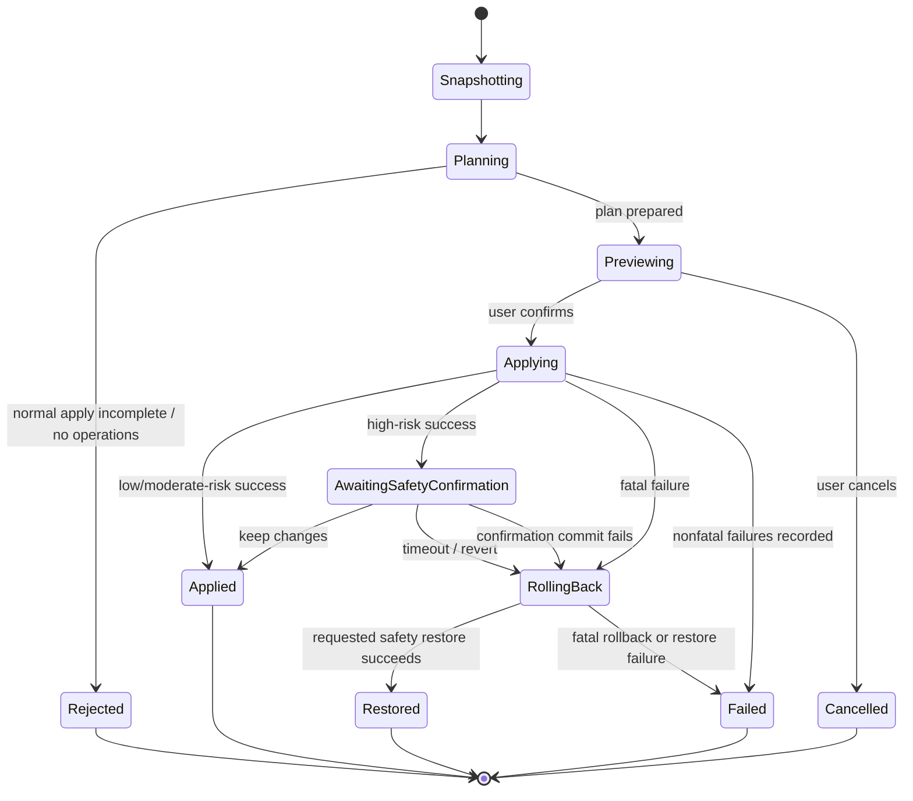

# Architecture

## Goals

The architecture isolates risky macOS mutations from profile semantics and UI. Most behavior must be provable with mocks on CI, which never changes host settings.

## Components

### DeskSetupCore

Pure Swift domain types, versioned document encoding, import validation, condition evaluation, readiness derivation, device matching, plan construction, transaction coordination, result models, redaction, and rotating diagnostic storage. It does not import SwiftUI or concrete system frameworks.

### DeskSetupPresentation

Pure Swift presentation state built on `DeskSetupCore` value types: saved/draft profile sessions, pending selection decisions, friendly included-value summaries, operation previews, menu action availability/reasons, deterministic condition choices, and typed IP/CIDR/location input validation. It does not import SwiftUI, AppKit, or concrete system frameworks. Swift Package Manager exposes it as a separate target; the generated single-app Xcode project compiles the same sources into the app target.

### DeskSetupSystem

Concrete adapters for Core Graphics, Core Audio, CoreWLAN/Network/SystemConfiguration, common input preferences, hardware/condition discovery, authorized-location reads, and Keychain. Each setting adapter owns its snapshot-to-operation comparison and rollback data. Input preference keys are isolated and reported as experimental.

### DeskSetupSwitcherApp

SwiftUI `MenuBarExtra`, Settings scene, observable application state, preview/confirmation sheets, app-lifetime profile editor ownership, one-shot permission UI, `SMAppService` login-item control, sanitized diagnostic browsing/clearing, import/export, About, localization, and accessibility metadata. The app binds pure presentation state to controls and coordinates core/system services; it does not implement display/audio/network/input mutations itself.

### Tests

Core unit tests use deterministic clocks, file systems, IDs, and mock adapters. Integration tests exercise an entire transaction with synthetic devices. Live tests are separate, read-only by default, and gated by explicit environment variables.

## Data flow

## Profile draft flow

`DeskSetupSwitcherApp` owns one `ProfileEditorModel`, so closing and reopening Settings does not silently replace an unsaved draft. `ProfileDraftSession` compares only user-editable fields for dirty state while retaining the latest non-editable metadata. Selection, creation, duplication, deletion, import, snapshot replacement, and ordinary termination route a dirty draft through save, discard, or cancel.

Save is asynchronous and marks the draft clean only after storage returns the persisted profile. `ApplicationModel` reloads the authoritative profile and merges only the current draft's editable fields, preventing an older draft from overwriting a newer last-application result or timestamp. A current-settings capture calls read-only snapshot services and replaces draft settings only; persistence still requires an explicit save.

## Transaction state machine

## Dependency rules

- Core owns protocols; system modules implement them.
- Presentation depends on Core value types but not system frameworks or UI frameworks.
- Concrete framework types do not cross adapter boundaries.
- Profiles store stable value types, never ephemeral handles or sole runtime display IDs.
- Persistence does not import system adapters.
- UI does not decide readiness or rollback policy.
- UI owns focus, sheets, localization, and accessibility delivery; pure presentation types own deterministic draft transitions, summaries, action reasons, and condition-input validation.
- An adapter never invokes another adapter directly; cross-group order is owned by the engine, while display-wide dependencies are represented as one atomic adapter operation.

## Failure model

Errors and results carry stable group/key identity, typed status/fatality, safe user-facing messages, and redacted diagnostics. Expected capability limitations are values, not crashes. Profile storage errors are mapped to typed, sanitized UI messages before accessibility announcements and diagnostics. The engine captures both the initiating failure and every rollback result. Rendered English/Korean and assistive-technology behavior is still being audited.

## Security boundaries

- Imported JSON is untrusted input and is decoded with resource limits then semantically validated.
- Secret access is isolated behind the `SecretStore` protocol, implemented by `KeychainSecretStore` over its injected `KeychainAPI` boundary; secrets are never printable profile or operation fields.
- Diagnostics pass through the redactor before disk persistence.
- The application performs no outbound network request.
- No adapter executes arbitrary shell commands.
- Any non-public preference-key implementation resides in an experimental adapter with a user-visible capability label.

## Persistence recovery

The store keeps a canonical document, a last-known-good backup, Foundation-managed atomic replacement files, and a quarantine directory. Recovery decisions are reported to the UI. Temporary-directory tests cover valid reload, failed candidate update, corrupt primary recovery, and corrupt primary-plus-backup reset. Sudden-power-loss durability and arbitrary filesystem fault injection are not claimed.

## Display safety

A display plan is regenerated against current modes immediately before execution. The adapter captures a complete restorable configuration and applies the requested atomic configuration with Core Graphics' app-only scope. The engine retains a confirmation token. **Keep Changes** calls the adapter confirmation hook to re-commit for the login session; timeout/revert or confirmation failure restores the backup. Permanent scope is not used. The app defers termination while an apply transaction is active, and app-only scope provides an additional temporary-change boundary before confirmation. Unsupported rotation/activation operations are omitted rather than using private APIs.

The temporary/confirm/rollback/timer paths are mock verified. No real display configuration, app-exit restore, or timeout restore has been run; see [SUPPORT-MATRIX.md](SUPPORT-MATRIX.md) for the interactive procedure.

## Stale-plan safety

Preview and execution are separated by a second read-only preparation. The app reloads the profile, recaptures conditions/snapshots, and compares execution-relevant capabilities, readiness, issues, operations, omissions, payloads, and rollback payloads. Generated IDs/timestamps do not invalidate an otherwise identical plan; any meaningful state or backup change returns to preview. This prevents a stale preview from applying with obsolete rollback state.

## Wi-Fi ambiguity safety

The network adapter treats a powered-on CoreWLAN interface with no readable SSID as unknown, never as positive evidence of disassociation. Association is planned only when macOS has a saved target profile/access and the current state is either positively disassociated or preflighted as restorable. Unavailable target or rollback preflight becomes an omission without exposing SSIDs or credentials.

## Current evidence boundary

UI-hardening commit `5f0cabc` passes full local and [GitHub Actions run `29181900967`](https://github.com/GGULBAE/desk-setup-switcher/actions/runs/29181900967) `make verify` with 214 default non-live tests (111 XCTest + 103 Swift Testing), including 55 presentation-specific cases, universal Debug/Release, Analyze, mounted package/checksum verification, and unsigned artifact upload. Local DMG SHA-256 is `6413e352b3d170b82510b7125f3f8cd0f52b9e5140bfa0977801887d09340e68`; downloaded CI artifact ID `8256718472` verified SHA-256 `f3d82b033e8e375c9063a9b72cbd174d94a03f0cdd4414961895db3b3dcfc3f4`. No live flag or current-tree screenshot/assistive-technology/TCC action was used.

The 2026-07-11 post-fix baseline passed full local `make verify` with 158 tests (83 XCTest + 75 Swift Testing), the universal package/checksum gate, and all five opt-in read-only discovery gates on an Apple M5 Mac running macOS 26.5.2. Its recorded local-DMG install launched background-only/menu-bar-only from `/Applications`; Korean popover/Settings and one accessibility label passed. It created one schema-v1 Ready profile from a read-only snapshot with all four groups, while the zero-operation plan kept Apply and Force Apply disabled. Default-on login registration plus opt-out/re-enable passed, with final cleanup opted out. The baseline local DMG SHA-256 is `246af7c21ac9f1ffd4c6f7523f857737f148e4354a948b0e4d9a2123bb5d827f`.

Initial Actions run `29154880831` for `0d8f510` preserves the Swift 6.1 actor-isolation failure history. Repair [run `29155207923`](https://github.com/GGULBAE/desk-setup-switcher/actions/runs/29155207923) remains historical compatibility evidence, while current UI run `29181900967` is the active implementation evidence above. Login approval/retry and actual reboot/login-at-boot, current-tree rendered localization/accessibility, import/export, TCC permission paths, quarantine/Gatekeeper, physical Intel, Keychain write, every live setting mutation, and release publication remain outside the verified boundary. Architecture diagrams describe call paths, not proof that each external effect works on every device.

## Evolution

New schema versions require migration fixtures. New adapters require protocol conformance, a support-matrix entry, capability tests, mock transaction tests, redaction review, and a documented manual verification procedure before being labelled supported.
