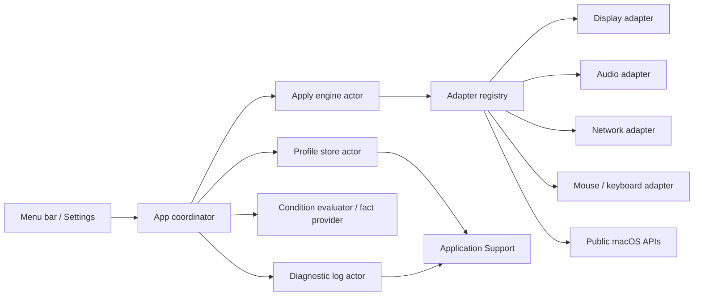
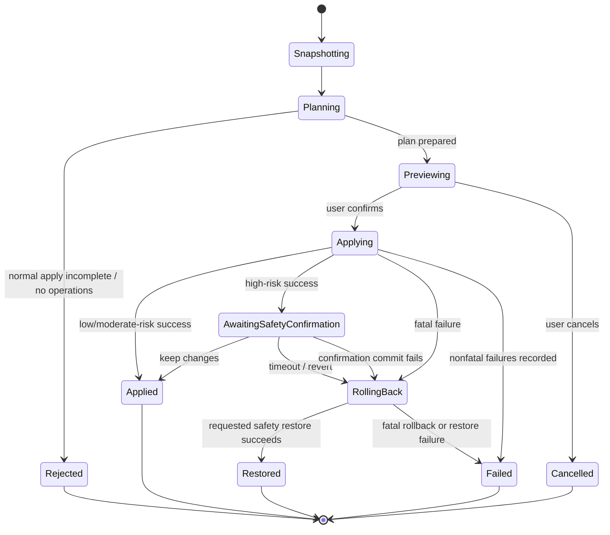

# Architecture

## Goals

The architecture isolates risky macOS mutations from profile semantics and UI. Most behavior must be provable with mocks on CI, which never changes host settings.

## Components

### DeskSetupCore

Pure Swift domain types, versioned document encoding, import validation, condition evaluation, readiness derivation, device matching, plan construction, transaction coordination, result models, redaction, and rotating diagnostic storage. It does not import SwiftUI or concrete system frameworks.

### DeskSetupSystem

Concrete adapters for Core Graphics, Core Audio, CoreWLAN/Network/SystemConfiguration, common input preferences, hardware/condition discovery, authorized-location reads, and Keychain. Each setting adapter owns its snapshot-to-operation comparison and rollback data. Input preference keys are isolated and reported as experimental.

### DeskSetupSwitcherApp

SwiftUI `MenuBarExtra`, Settings scene, observable application state, preview/confirmation sheets, profile editor, one-shot permission UI, `SMAppService` login-item control, sanitized diagnostic browsing/clearing, import/export, About, localization, and accessibility metadata. The app coordinates core/system services; it does not implement display/audio/network/input mutations itself.

### Tests

Core unit tests use deterministic clocks, file systems, IDs, and mock adapters. Integration tests exercise an entire transaction with synthetic devices. Live tests are separate, read-only by default, and gated by explicit environment variables.

## Data flow

## Transaction state machine

## Dependency rules

- Core owns protocols; system modules implement them.
- Concrete framework types do not cross adapter boundaries.
- Profiles store stable value types, never ephemeral handles or sole runtime display IDs.
- Persistence does not import system adapters.
- UI does not decide readiness or rollback policy.
- An adapter never invokes another adapter directly; cross-group order is owned by the engine, while display-wide dependencies are represented as one atomic adapter operation.

## Failure model

Errors and results carry stable group/key identity, typed status/fatality, safe user-facing messages, and redacted diagnostics. Expected capability limitations are values, not crashes. The engine captures both the initiating failure and every rollback result. Complete message localization is still being audited.

## Security boundaries

- Imported JSON is untrusted input and is decoded with resource limits then semantically validated.
- Secret access is isolated behind the `SecretStore` protocol, implemented by `KeychainSecretStore` over its injected `KeychainAPI` boundary; secrets are never printable profile or operation fields.
- Diagnostics pass through the redactor before disk persistence.
- The application performs no outbound network request.
- No adapter executes arbitrary shell commands.
- Any non-public preference-key implementation resides in an experimental adapter with a user-visible capability label.

## Persistence recovery

The store keeps a canonical document, a last-known-good backup, Foundation-managed atomic replacement files, and a quarantine directory. Recovery decisions are reported to the UI. Temporary-directory tests cover valid reload, failed candidate update, corrupt primary recovery, and corrupt primary-plus-backup reset. Sudden-power-loss durability and arbitrary filesystem fault injection are not claimed.

## Display safety

A display plan is regenerated against current modes immediately before execution. The adapter captures a complete restorable configuration and applies the requested atomic configuration with Core Graphics' app-only scope. The engine retains a confirmation token. **Keep Changes** calls the adapter confirmation hook to re-commit for the login session; timeout/revert or confirmation failure restores the backup. Permanent scope is not used. The app defers termination while an apply transaction is active, and app-only scope provides an additional temporary-change boundary before confirmation. Unsupported rotation/activation operations are omitted rather than using private APIs.

The temporary/confirm/rollback/timer paths are mock verified. No real display configuration, app-exit restore, or timeout restore has been run; see [SUPPORT-MATRIX.md](SUPPORT-MATRIX.md) for the interactive procedure.

## Stale-plan safety

Preview and execution are separated by a second read-only preparation. The app reloads the profile, recaptures conditions/snapshots, and compares execution-relevant capabilities, readiness, issues, operations, omissions, payloads, and rollback payloads. Generated IDs/timestamps do not invalidate an otherwise identical plan; any meaningful state or backup change returns to preview. This prevents a stale preview from applying with obsolete rollback state.

## Wi-Fi ambiguity safety

The network adapter treats a powered-on CoreWLAN interface with no readable SSID as unknown, never as positive evidence of disassociation. Association is planned only when macOS has a saved target profile/access and the current state is either positively disassociated or preflighted as restorable. Unavailable target or rollback preflight becomes an omission without exposing SSIDs or credentials.

## Current evidence boundary

Final local `make verify` passes with 158 tests (83 XCTest + 75 Swift Testing), as do the universal package/checksum gate and all five opt-in read-only discovery gates on an Apple M5 Mac running macOS 26.5.2. A fresh final-DMG install launched background-only/menu-bar-only from `/Applications`; Korean popover/Settings and an accessibility label passed. It created one schema-v1 Ready profile from a read-only snapshot with all four groups, while the zero-operation plan kept Apply and Force Apply disabled. Default-on login registration plus opt-out/re-enable passed, with final cleanup opted out. Login approval/retry and actual reboot/login-at-boot, full localization/accessibility, import/export, permission, quarantine/Gatekeeper, pushed CI, physical Intel, Keychain write, and every live setting mutation remain outside the verified boundary. The final DMG SHA-256 is `3f99ebcea13ea1495e9c2471a45f66dacb851e3ba6670ce16aa84f48b26b99b7`. Architecture diagrams describe call paths, not proof that each external effect works on every device.

## Evolution

New schema versions require migration fixtures. New adapters require protocol conformance, a support-matrix entry, capability tests, mock transaction tests, redaction review, and a documented manual verification procedure before being labelled supported.
