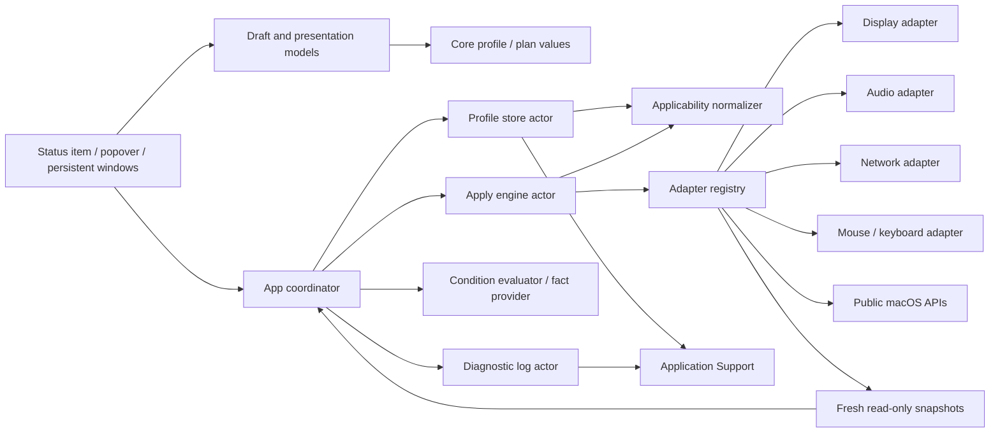
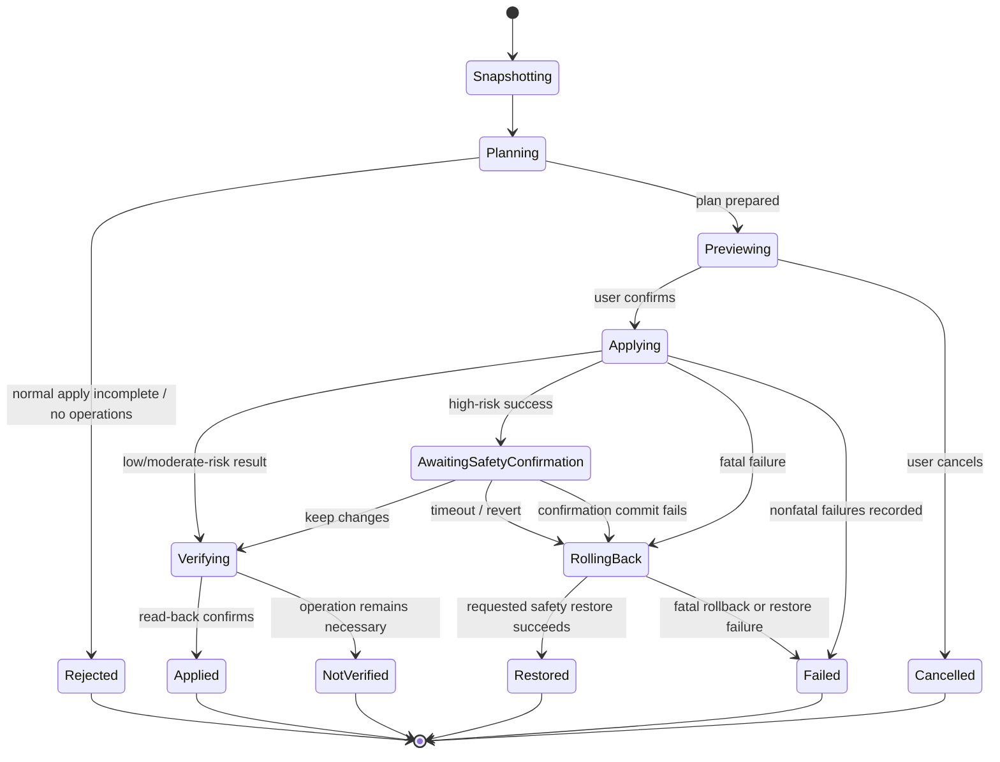

# Architecture

## Goals

The architecture isolates risky macOS mutations from profile semantics and UI. Most behavior must be provable with mocks on CI, which never changes host settings.

## Components

### DeskSetupCore

Pure Swift domain types, versioned document encoding, import validation, idempotent profile-applicability normalization, condition evaluation, readiness derivation, device matching, plan construction, transaction coordination, result models, redaction, and rotating diagnostic storage. It does not import SwiftUI or concrete system frameworks.

### DeskSetupPresentation

Pure Swift presentation state built on `DeskSetupCore` value types: saved/draft profile sessions, pending selection and dirty-Apply decisions, friendly included-value summaries, operation previews, state-aware primary Review actions, value-free capture summaries, post-apply verification/result classification, field validation, and legacy condition choice/input-validation utilities retained as compatibility regression support rather than bound Settings controls. It does not import SwiftUI, AppKit, or concrete system frameworks. Swift Package Manager exposes it as a separate target; the generated single-app Xcode project compiles the same sources into the app target.

### DeskSetupSystem

Concrete adapters for Core Graphics, Core Audio, CoreWLAN/Network/SystemConfiguration, common input preferences, hardware/condition discovery, authorized-location reads, and Keychain. Each setting adapter owns its snapshot-to-operation comparison and rollback data. Core Graphics also supplies a typed ephemeral supported-mode catalog through read-only snapshots; it never enters profile JSON. Input preference keys are isolated and reported as experimental, and their writes require immediate adapter read-back agreement.

### DeskSetupSwitcherApp

An AppKit-owned `NSStatusItem` + `NSPopover` tray with a SwiftUI root hosted by `NSHostingController`, compact header actions, a flat always-expanded typed setting editor, inline field validation, persistent Settings/workflow windows, app-lifetime profile editor and tray-presentation ownership, `SMAppService` login-item control, sanitized diagnostic browsing/clearing, import/export, About, localization, and accessibility metadata. The app binds pure presentation state to controls and coordinates core/system services; it does not implement display/audio/network/input mutations itself.

### Tests

Core unit tests use deterministic clocks, file systems, IDs, and mock adapters. Integration tests exercise an entire transaction with synthetic devices. Live tests are separate, read-only by default, and gated by explicit environment variables.

## Data flow

## Tray surface lifecycle

`DeskSetupSwitcherApp` strongly owns one `TrayPopoverController`, `TrayPresentationModel`, Settings controller, workflow controller, and application-window activation coordinator for the process lifetime. `TrayPopoverController` creates one status item, one `.applicationDefined` popover, and one hosting controller. Opening computes a `TrayOpenSessionGeometry` from profile count and the active screen's visible frame; that point-sized viewport is immutable until close. Empty and first-profile states share 260 points, two profiles use 316, and three or more use the 560-point cap. The SwiftUI root ignores native horizontal safe-area insets and owns the only 16-point horizontal content padding. Truly empty idle content is a centered non-scrolling body; cards and transient notices use one generation-keyed overflow scroll view. A new screen or scale factor affects the next open generation, not the current one.

`TrayAction` is the only user-action vocabulary at the surface boundary. `TrayActionRouter` maps every action to exactly one disposition: keep the surface open, present a persistent destination and close only after it is visible and key, or terminate. It coalesces identical in-flight handoffs and checks the session generation before closing, so a late completion cannot close a reopened popover. Presentation failure or cancellation records a reachable error and does not close. App deactivation and scoped outside-mouse monitors provide explicit dismissal; Esc is handled by the SwiftUI root. No test injects input events or opens the live surface.

Permission, capture, dirty-draft, preview, safety-confirmation, result, deletion, focus, and in-flight task state live above the SwiftUI root. `onDisappear` is therefore not a cancellation boundary. Persistent AppKit windows host workflows that must outlive the popover; Settings/window handoff awaits actual visibility and key state rather than an arbitrary delay. While one or more destination windows are presented, `ApplicationWindowActivationCoordinator` switches the process to `.regular` and the windows participate in the normal cycle; explicit red-close orders out the existing controller and the last hidden destination restores `.accessory`. Failed/cancelled presentation releases its ownership. `.applicationDefined` is an AppKit behavior choice, not proof that every native dismissal path is correct on every supported macOS release, so installed interaction remains a separate evidence gate.

## Profile draft flow

`DeskSetupSwitcherApp` owns one `ProfileEditorModel`, so closing and reopening Settings does not silently replace an unsaved draft. `ProfileDraftSession` compares only user-editable fields for dirty state while retaining the latest non-editable metadata. Selection, creation, duplication, deletion, import, snapshot replacement, and ordinary termination route a dirty draft through save, discard, or cancel. Identical session/activity values are not republished, preventing redundant whole-editor invalidations during control updates.

Save is asynchronous and marks the draft clean only after storage returns the persisted profile. `ApplicationModel` reloads the authoritative profile and merges only the current draft's editable fields, preventing an older draft from overwriting a newer last-application result or timestamp. The editor does not expose a current-settings draft replacement action. Tray Capture rejects an unusable snapshot and atomically creates plus selects a new reviewable profile before emitting transient success.

The app layer owns compact header actions and a flat, always-expanded Display/Audio/Network editor. There is no profile activation toggle and no group/option disclosure state. Every supported Settings width keeps one horizontal workspace with a fixed sidebar and editor; footer and save/revert bars remain outside scrolling at stable heights. A Settings presentation keeps its typed runtime catalog unchanged while a read-only refresh is in flight, adopts at most the first completed refresh for that presentation, and then ignores incidental or repeated snapshot publications until reopening deliberately adopts the newest snapshot. Reinvoking Settings while its window is already visible does not create a new presentation generation or reset editor focus/scroll. Each supported leaf owns its Include switch; unsupported or ambiguous controls are not projected as new choices. If a persisted included Audio, ColorSync, or service-IPv4 target becomes unavailable, the app instead projects a warning row with an Include-off repair control. Device-scoped audio capability is resolved against the target UID selected by the draft. `VisibleSettingRegistry` is the single contract table for the nine visible setting kinds and requires capture, edit, validation, planning, apply, verification, and rollback metadata for each.

Condition authoring is not bound into current Settings. Stored and imported conditions continue through persistence for round-trip compatibility, but the current manual readiness/preview/execution path deliberately treats them as dormant and non-blocking. The evaluator remains in Core for compatibility tests and any future explicitly designed condition surface; no automatic application exists.

## Apply request and result flow

The profile row asks `PrimaryApplyActionState` for one action. A complete executable plan selects Review; a partial plan with executable items selects Review Available in the same slot. Those actions only open a persistent preview. The separate Apply Profile confirmation starts execution, while locks, pending protected-change confirmation, preparation, zero-operation, and unavailable states carry typed non-color reasons. Cached readiness may remain usable during a refresh, while per-profile preparation prevents duplicate requests.

Before planning, `DirtyApplyProtectionDecision` compares the target with the app-lifetime editor session. Save/discard/cancel must resolve explicitly; save failure or cancel ends the request. The normalizer then removes unsupported applicability. Immediately before execution, a fresh profile/snapshot plan must remain execution-equivalent; otherwise no adapter is invoked and the workflow returns to a visibly marked refreshed review. JSON payload object ordering is canonicalized because it is not state, while changed values and rollback evidence remain blocking. A rejected confirmation also becomes a visible workflow error rather than a silent return.

After execution, a fresh read-only plan classifies executed operation references. If the same operation remains necessary, or if its capability/snapshot cannot be read safely because preparation is unavailable or fatal, the result changes from succeeded to not verified. Intentional available-items omissions and newly required operations remain separate. Rollback presentation matches operation UUIDs so same-key operations are not conflated and successful restoration cannot erase an initiating failure. The menu owns a compact count card and a value-free itemized detail view. A high-risk display result is finalized only after Keep/Revert resolves.

## Transaction state machine

## Dependency rules

- Core owns protocols; system modules implement them.
- Presentation depends on Core value types but not system frameworks or UI frameworks.
- Concrete framework types do not cross adapter boundaries.
- Profiles store stable value types, never ephemeral handles or sole runtime display IDs.
- Persistence does not import system adapters.
- UI does not decide readiness or rollback policy.
- UI owns focus, sheets, localization, accessibility delivery, and runtime-catalog projection; pure presentation types own deterministic draft transitions, action decisions, summaries, validation, and read-back result classification. Condition-input utilities remain isolated compatibility support for persisted data, not a current Settings surface or manual Apply gate.
- An adapter never invokes another adapter directly; cross-group order is owned by the engine, while display-wide dependencies are represented as one atomic adapter operation.

## Failure model

Errors and results carry stable operation UUID plus group/key identity, typed status/fatality, safe user-facing messages, and redacted diagnostics. Expected capability limitations are values, not crashes. Profile storage errors and field-validation issues are separated and mapped to typed, sanitized UI messages before accessibility announcements and diagnostics. The engine captures both the initiating failure and every rollback result; presentation reconciles each rollback only with its UUID-matched result and additionally distinguishes adapter success from available, matching read-back verification. The source/test-backed localization and accessibility-structure audit is complete; rendered English/Korean layout and assistive-technology behavior remain manually unverified.

## Security boundaries

- Imported JSON is untrusted input and is decoded with resource limits then semantically validated.
- Secret access is isolated behind the `SecretStore` protocol, implemented by `KeychainSecretStore` over its injected `KeychainAPI` boundary; secrets are never printable profile or operation fields.
- Diagnostics pass through the redactor before disk persistence.
- The application performs no outbound network request.
- No adapter executes arbitrary shell commands.
- Any non-public preference-key implementation resides in an experimental adapter with a user-visible capability label.

## Persistence recovery

The store keeps a canonical document, a last-known-good backup, same-directory private staging files, and a quarantine directory. It opens and verifies the owner-controlled parent once, removes and absence-verifies extended ACLs before enforcing private directory/file modes, then keeps staging creation, commit, rollback, cleanup, and directory synchronization relative to that directory descriptor. A fully encoded and synchronized ACL-free `0600` staging inode is published with exclusive rename when the destination was missing or with an atomic leaf swap when replacing an existing regular file. Post-commit parent and leaf identity checks either prove the new state or attempt a no-follow, identity-guarded rollback; there is no path-based production mutation fallback. Recovery decisions are reported to the UI. Every decoded, loaded, updated, or imported document passes the idempotent applicability normalizer before becoming authoritative, preserving snapshot values while excluding unsupported mutations. Temporary-directory tests cover valid reload, normalization, private ACL repair, failed candidate update, both post-commit rollback branches, staged failure, corrupt primary recovery, canonical backup-first recovery, corrupt primary-plus-backup reset, parent-path replacement, and regular/symlink leaf replacement. Darwin has no public inode-conditional rename or unlink, so a noncooperative same-UID process can still race the final adjacent identity-check and mutation syscalls. An abrupt stop after an existing-leaf swap but before unlinking the displaced leaf can retain the former private `0600` file under its randomized staging name. Parent-directory synchronization is best effort and sudden-power-loss durability is not claimed.

## Protected display and network safety

A display plan is regenerated against current modes immediately before execution. The adapter captures a complete restorable configuration and applies requested topology with Core Graphics' app-only scope. ColorSync changes use public device-profile mappings and exact preflight mappings. A network plan captures the service's exact serialized IPv4 protocol dictionary before an authorized SystemConfiguration write. The engine retains one confirmation token covering every completed high-risk display/network operation. **Keep Changes** confirms in apply order; timeout, Revert, safety-window close, or app termination restores protected operations in reverse order, with network first because network applies last. Permanent display scope is not used before confirmation.

ColorSync profile identity is portable: profile JSON stores the registered profile identifier, SHA-256 of ICC file bytes, and display name, never a runtime URL. At execution the adapter resolves exactly one current catalog entry, applies it through public ColorSync mapping, reads it back, and retains the previous mapping for rollback. The feature means ICC display-profile selection only; it does not claim HDR, pixel-encoding, vendor presets, or arbitrary color-mode control.

Service IPv4 identity is the portable tuple of service kind, service name, and interface type. A row is projected only when that identity resolves exactly once and exact rollback data exists. The live adapter creates Authorization Services rights, opens `SCPreferences` with authorization, resolves the service and IPv4 protocol again, locks, sets, commits, applies, unlocks, waits for an `SCDynamicStore` notification, and performs exact read-back. Every failure is typed and sanitized. Dynamic completion and timeout have deterministic no-sleep tests; no real authorization prompt or network write was executed.

The temporary/confirm/rollback/timer/window-close/app-termination paths are mock verified. No real display, ColorSync, audio, or network mutation, app-exit restore, or timeout restore has been run; see [SUPPORT-MATRIX.md](SUPPORT-MATRIX.md) for the interactive procedure.

## Stale-plan safety

Dirty-draft resolution, preview, and execution are separate barriers. The app first refuses to plan silently from an older saved profile, then reloads the chosen persisted profile, applies the current normalization/dormant-condition policy, recaptures snapshots, and compares execution-relevant capabilities, readiness, issues, operations, omissions, payloads, and rollback payloads. Generated IDs/timestamps do not invalidate an otherwise identical plan; any meaningful state or backup change returns to preview. This prevents either an unsaved or system-stale value from applying with obsolete rollback state.

## Wi-Fi ambiguity safety

The network adapter treats a powered-on CoreWLAN interface with no readable SSID as unknown, never as positive evidence of disassociation. Association is planned only when macOS has a saved target profile/access and the current state is either positively disassociated or preflighted as restorable. Unavailable target or rollback preflight becomes an omission without exposing SSIDs or credentials.

## Current evidence boundary

The settings-lifecycle/UI-declutter refactor passed integrated non-live `make verify` on 2026-07-16: localization and source-policy lint; 401 default cases (144 XCTest with five opt-in skips plus 257 Swift Testing with two default-disabled opt-in cases); Swift Debug/Release; universal Xcode Debug/Release; Analyze; package/checksum; mounted metadata/resources/`x86_64 arm64`; and ad-hoc/no-Developer-ID signature classification. `git diff --check` passed separately. The final DMG SHA-256 is `f3aa610026179161208dec2cb2ef6185768843becd8e0e56bccc9f8abab37f2b`. The package was not installed or launched, and no live display, audio, network, mouse, keyboard, TCC, Keychain, or third-party configuration mutation ran.

The preceding UI-stability follow-up passed integrated non-live `make verify` on 2026-07-16: localization and source-policy lint; 375 default cases (134 XCTest with five skips plus 241 Swift Testing with two disabled opt-in cases); Swift Debug/Release; universal Xcode Debug/Release; Analyze; package/checksum; mounted metadata/resources/`x86_64 arm64`; and ad-hoc/no-Developer-ID signature classification. `git diff --check` passed separately. Its historical DMG SHA-256 is `516b968718aeb3c1c247e1a2deca7a28d45820d119f31ea992d4b475071f3638`. Thirteen tray, ten full Settings-root, and three workflow attached/offscreen evidence pairs cover contained layout, forced localization paths, refreshed state, and the 520×360 large-text minimum without mutation. They do not prove single-frame native flicker absence, installed click-through, native localization context, VoiceOver, or hardware behavior.

Tray Surface v2 passed integrated non-live `make verify` on 2026-07-15: lint/localization policy; 326 default cases (130 XCTest plus 196 Swift Testing cases, six opt-in skips), zero failures; Swift Debug/Release; universal Xcode Debug/Release; Analyze; package/checksum; mounted metadata/resources/`x86_64 arm64`; and ad-hoc/no-Developer-ID signature classification. Separately, `git diff --check` passed. The verified DMG SHA-256 is `2e5248175e8c68810bd17abf52da30356ff9ccee7cd167d97ac3b815e3b04127`. The package was not installed or launched. Twelve detached-host PNG/metadata pairs prove the contained synthetic SwiftUI states only; they do not prove `NSStatusItem` interaction, actual popover chrome/anchor/material/ghost-frame behavior, native dismissal timing, first responder, VoiceOver, or TCC. Earlier `MenuBarExtra` installed interactions are historical and cannot close those v2 gaps.

The preceding header/editor follow-up passed full local `make verify` with 215 default non-live tests (112 XCTest + 103 Swift Testing), including 56 presentation-specific cases, universal Debug/Release, Analyze, and mounted package/checksum verification. Its local DMG SHA-256 is `45772d20e6d7655c41ed4ff5d0261257b98f1361f4cf8cc38ebf837720d5820b`. UI-hardening commit `5f0cabc`, [GitHub Actions run `29181900967`](https://github.com/GGULBAE/desk-setup-switcher/actions/runs/29181900967), and artifact `8256718472` remain historical remote evidence and predate the current follow-up.

The 2026-07-11 post-fix baseline passed full local `make verify` with 158 tests (83 XCTest + 75 Swift Testing), the universal package/checksum gate, and all five opt-in read-only discovery gates on an Apple M5 Mac running macOS 26.5.2. Its recorded local-DMG install launched background-only/menu-bar-only from `/Applications`; Korean popover/Settings and one accessibility label passed. It created one schema-v1 Ready profile from a read-only snapshot with all four groups, while the zero-operation plan kept Apply and Force Apply disabled. Default-on login registration plus opt-out/re-enable passed, with final cleanup opted out. The baseline local DMG SHA-256 is `246af7c21ac9f1ffd4c6f7523f857737f148e4354a948b0e4d9a2123bb5d827f`.

Initial Actions run `29154880831` for `0d8f510` preserves the Swift 6.1 actor-isolation failure history. Repair [run `29155207923`](https://github.com/GGULBAE/desk-setup-switcher/actions/runs/29155207923) remains historical compatibility evidence, while UI-hardening run `29181900967` is the latest remote implementation evidence above. Actual v2 tray interaction, login approval/retry and reboot/login-at-boot, import/export, TCC permission paths, quarantine/Gatekeeper, physical Intel, Keychain write, every live setting mutation/rollback, full VoiceOver, signing/notarization, and release publication remain outside the verified boundary. No UI automation was used. Architecture diagrams describe call paths, not proof that each external effect works on every device.

## Evolution

New schema versions require migration fixtures. New adapters require protocol conformance, a support-matrix entry, capability tests, mock transaction tests, redaction review, and a documented manual verification procedure before being labelled supported.

## Tray and profile refinement contract

The tray's fixed open-session geometry has an explicit reopen boundary. Before and immediately after `NSPopover.show`, the AppKit host frame and bounds are reset to a zero origin while retaining the session's fixed content size. The overflow scroll view is keyed by the open generation and defaults to top before the later attachment-scoped top request. The first content block itself owns the anchor ID, so no zero-height sibling participates in `VStack` spacing. Focus-driven scrolling is nonanimated. This prevents a stale offset, lost first-open request, and spacing-only blank row without measured-height feedback or a corrective magic offset.

Settings and workflow windows are app-lifetime controllers rather than popover-owned destinations. Red-close orders the same window out instead of destroying its root, draft, navigation, or controller. Presentation registers the window with the shared activation coordinator, changes the process to an ordinary app while any destination is visible, deminiaturizes if necessary, makes the window key/front, and completes exactly once only after visible/key state is observed. Red-closing the final destination restores tray-only accessory policy; cancellation or failure also releases registration. The tray router orders the popover out after successful completion; cancellation, stale completion, or failure leaves the tray available.

The status item is one variable-length `NSStatusItem`. Its value is derived from current in-memory readiness, never a persisted `lastApplication`: applying has priority; otherwise only a fresh `.ready`, zero-operation profile with included applicable payload may supply its user symbol and shortened name. A background refresh retains the last usable cache instead of briefly erasing a match. Because the status-item button is also the popover anchor, duplicate presentations are ignored and any title/width change is coalesced until the visible popover has closed. Missing, invalid, deleted, partial, failed, or genuinely stale state uses `square.stack.3d.up`.

The default profile editor is a deliberate projection over the full backward-compatible document. It shows metadata name/symbol plus Display, Audio, and Network. Description, conditions, Input, display origin/rotation/active, legacy global network values, DNS/proxy, system-output UID, and mute remain decodable and round-trip unchanged but the applicability normalizer excludes them from newly prepared apply payloads. The retired condition-editor source is removed from the app target while its Core schema and compatibility tests remain. Removing a control is therefore not destructive migration and cannot silently re-apply a hidden value.

`AudioProfileSettings.inputVolume` is additive and decodes absent legacy values as excluded. The public Core Audio adapter uses the default input device's input scope and preserves the complete adapter contract: snapshot, scalar/range validation, no-op plan, settable capability, apply, typed rollback, read-back diagnostics, and hot-plug/missing-device failure. Unsupported or non-settable devices omit only the volume operation.

Service IPv4 values use a portable `NetworkServiceIdentity` made from service kind, service name, and interface type. Runtime SystemConfiguration service IDs and BSD names are evidence, not persistent identity by themselves. Public SystemConfiguration reads produce Ethernet/Wi-Fi service rows, while public CoreWLAN configuration supplies a session-only, credential-free saved-network choice list; neither catalog is persisted. Exact per-service DHCP/manual IPv4 uses authorized public SystemConfiguration writes only when one portable identity and exact serialized rollback dictionary resolve; zero/multiple matches or missing rollback evidence produce typed omissions without suppressing unrelated operations. Display color uses a portable ColorSync registered ID plus ICC SHA-256, resolves only the current public profile catalog, reads back the resulting mapping, and retains the previous mapping for rollback. Neither path claims unsupported global network administration, HDR, pixel encoding, or vendor color modes.
