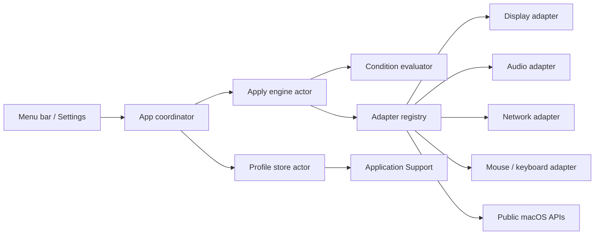
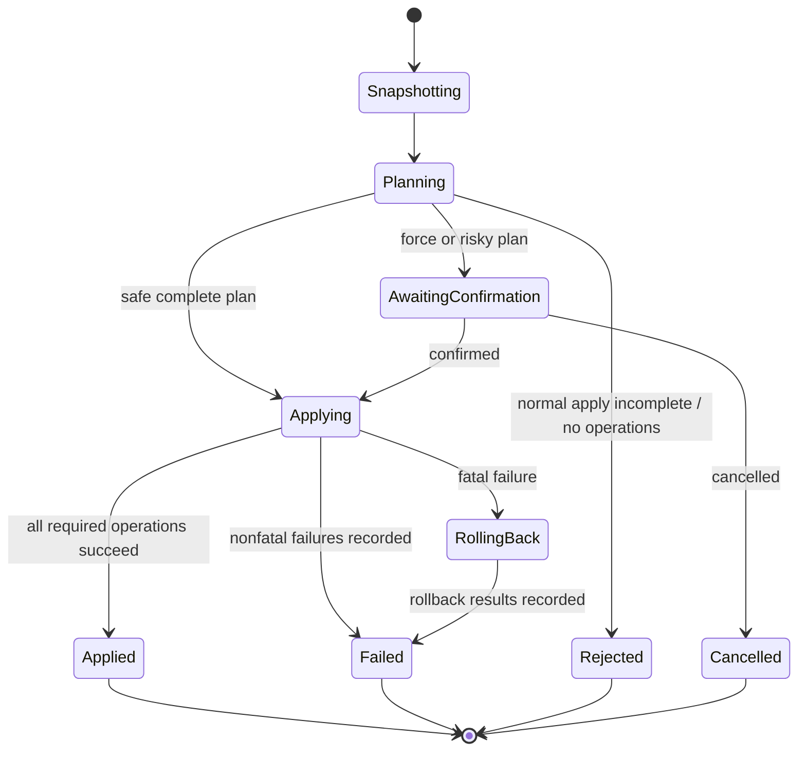

# Architecture

## Goals

The architecture isolates risky macOS mutations from profile semantics and UI. Most behavior must be provable with mocks on CI, which never changes host settings.

## Components

### DeskSetupCore

Pure Swift domain types, versioned document encoding, import validation, condition evaluation, readiness derivation, device matching, plan construction, transaction coordination, result models, and redaction. It does not import SwiftUI or concrete system frameworks.

### DeskSetupSystem

Concrete adapters for Core Graphics, Core Audio, CoreWLAN/Network/SystemConfiguration, common input preferences, hardware discovery, permissions, Keychain, diagnostics, and `SMAppService`. Each adapter owns its snapshot-to-operation comparison and rollback data.

### DeskSetupSwitcherApp

SwiftUI `MenuBarExtra`, Settings scene, observable application state, preview/confirmation sheets, profile editor, permissions, diagnostics, import/export, About, localization, and accessibility metadata. The app talks to a coordinator, never directly to system frameworks.

### Tests

Core unit tests use deterministic clocks, file systems, IDs, and mock adapters. Integration tests exercise an entire transaction with synthetic devices. Live tests are separate, read-only by default, and gated by explicit environment variables.

## Data flow

## Transaction state machine

## Dependency rules

- Core owns protocols; system modules implement them.
- Concrete framework types do not cross adapter boundaries.
- Profiles store stable value types, never ephemeral handles or sole runtime display IDs.
- Persistence does not import system adapters.
- UI does not decide readiness or rollback policy.
- An adapter never invokes another adapter directly; dependencies are operations in the plan.

## Failure model

Errors carry a stable code, setting/group identity, localized recovery suggestion, fatality, and safe diagnostics. Expected capability limitations are values, not crashes. The engine captures both the initiating failure and every rollback result.

## Security boundaries

- Imported JSON is untrusted input and is decoded with resource limits then semantically validated.
- Keychain access is behind a secret-store protocol and secrets are never printable model fields.
- Diagnostics pass through the redactor before disk persistence.
- The application performs no outbound network request.
- No adapter executes arbitrary shell commands.
- Any non-public preference-key implementation resides in an experimental adapter with a user-visible capability label.

## Persistence recovery

The store keeps a canonical document, a last-known-good backup, temporary replacement files, and a quarantine directory. Recovery decisions are reported to the UI. Tests inject write, replace, decode, and backup failures.

## Display safety

A display plan is validated against current modes immediately before commit. The adapter captures the complete restorable configuration, applies a single Core Graphics configuration where possible, and exposes a confirmation token. If confirmation expires, the coordinator calls rollback even when the app window is not frontmost. Unsupported rotation/activation operations are omitted with reasons rather than using private APIs.

## Evolution

New schema versions require migration fixtures. New adapters require protocol conformance, a support-matrix entry, capability tests, mock transaction tests, redaction review, and a documented manual verification procedure before being labelled supported.
